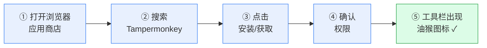
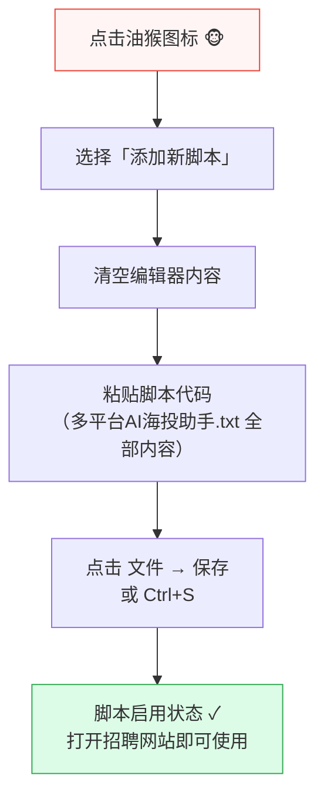
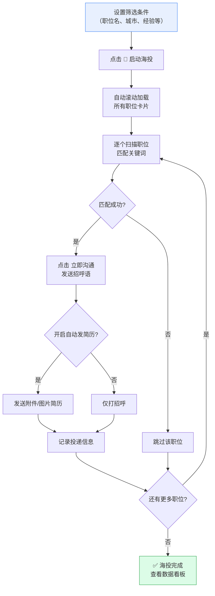
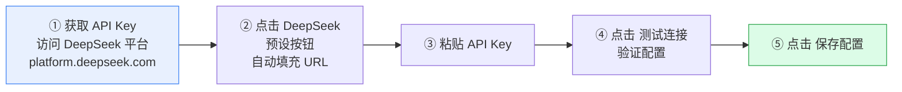
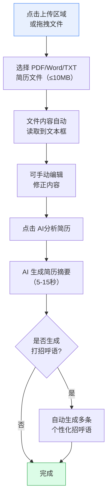
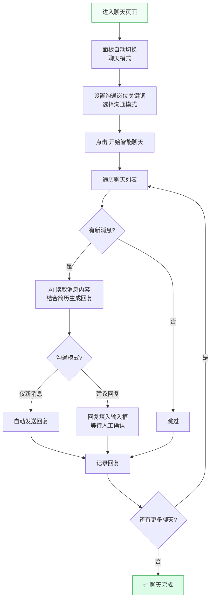
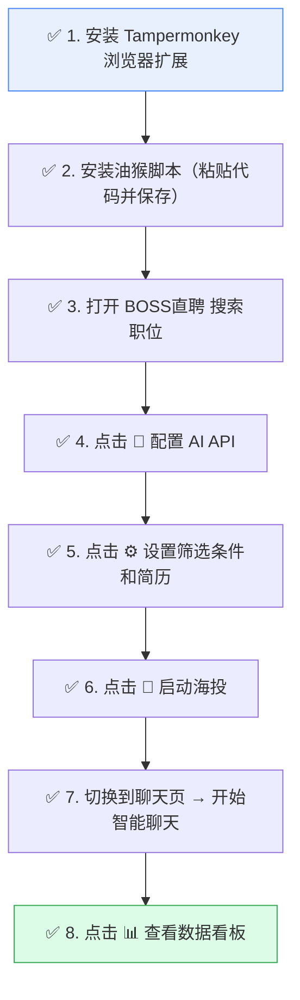

# 多平台 AI 海投助手 - 操作使用说明

> **版本**：v4.0.0 | **作者**：Dkui | **支持平台**：BOSS直聘、智联招聘、前程无忧、拉勾网、猎聘

---

## 目录

- [一、前置准备：安装 Tampermonkey 浏览器扩展](#一前置准备安装-tampermonkey-浏览器扩展)
- [二、安装油猴脚本](#二安装油猴脚本)
- [三、主面板界面总览](#三主面板界面总览)
- [四、职位列表页操作指南](#四职位列表页操作指南)
- [五、AI 配置（智能回复核心）](#五ai-配置智能回复核心)
- [六、插件设置详解](#六插件设置详解)
- [七、聊天页智能沟通](#七聊天页智能沟通)
- [八、数据看板](#八数据看板)
- [九、常见问题 FAQ](#九常见问题-faq)

---

## 一、前置准备：安装 Tampermonkey 浏览器扩展

### 1.1 什么是 Tampermonkey？

Tampermonkey（油猴）是一款免费的浏览器扩展，用于在网页上运行自定义 JavaScript 脚本（即"油猴脚本"）。本助手正是以油猴脚本的形式运行。

### 1.2 安装流程



### 1.3 各浏览器安装方式

| 浏览器 | 安装地址 | 说明 |
|--------|----------|------|
| **Chrome** | [Chrome 网上应用店](https://chromewebstore.google.com/detail/tampermonkey/dhdgffkkebhmkfjojejmpbldmpobfkfo) | 需科学上网或使用 Edge 商店 |
| **Edge** | [Edge 扩展商店](https://microsoftedge.microsoft.com/addons/detail/tampermonkey/iikmkjmpaadaobahmlepnlendncbjghd) | 推荐国内用户 |
| **Firefox** | [Firefox 附加组件](https://addons.mozilla.org/firefox/addon/tampermonkey/) | 直接安装 |
| **Opera** | [Opera 扩展商店](https://addons.opera.com/extensions/details/tampermonkey-beta/) | 直接安装 |

### 1.4 安装步骤详解

**Step 1**：打开上方对应浏览器的链接，点击 **"获取/安装"** 按钮

```
┌─────────────────────────────────────────────────┐
│  Tampermonkey - Chrome 网上应用店                    │
│                                                     │
│  ┌─────────┐                                        │
│  │  🐵     │  Tampermonkey                          │
│  │  图标   │  版本: 5.x.x                           │
│  └─────────┘  用户数: 10,000,000+                    │
│                                                     │
│  ┌──────────────────────┐                           │
│  │  ▶ 添加至 Chrome      │  ◀── 点击此按钮           │
│  └──────────────────────┘                           │
└─────────────────────────────────────────────────┘
```

**Step 2**：弹出权限确认窗口，点击 **"添加扩展程序"**

**Step 3**：安装成功后，浏览器右上角工具栏出现油猴图标 🐵

> **提示**：如果看不到图标，点击浏览器工具栏的 "拼图" 图标 🧩，将 Tampermonkey 固定到工具栏。

---

## 二、安装油猴脚本

### 2.1 安装流程



### 2.2 详细步骤

1. **打开脚本管理面板**：点击浏览器工具栏的油猴图标 → 点击 **"管理面板"**（仪表盘）

2. **新建脚本**：
   - 点击顶部 **"实用工具"** 选项卡
   - 在 "文件" 区域找到 **"导入"**，可以选择本地 `.txt` 文件直接导入
   - 或者点击 **"编辑器"** → **"新建脚本"**，清空默认内容，将 `多平台AI海投助手.txt` 的全部内容粘贴进去

3. **保存脚本**：按 `Ctrl + S` 或点击菜单 **文件 → 保存**

4. **验证安装**：在 Tampermonkey 管理面板中，应能看到 **"Dkui - 多平台AI海投助手"** 处于启用状态（开关为蓝色）

```
┌──────────────────────────────────────────────────────┐
│  Tampermonkey 管理面板                                  │
│                                                        │
│  已安装脚本:                                             │
│  ┌──────────────────────────────────────────────────┐  │
│  │  [🔵] Dkui - 多平台AI海投助手    v4.0.0   ← 已启用 │  │
│  └──────────────────────────────────────────────────┘  │
│                                                        │
│  说明: 脚本已安装成功，打开支持的招聘网站即可自动运行       │
└──────────────────────────────────────────────────────┘
```

### 2.3 支持的网站

安装后，打开以下任意网站，页面右上角会自动出现助手面板：

| 平台 | 网址 | 支持度 |
|------|------|--------|
| BOSS直聘 | `www.zhipin.com` | ✅ 完整支持 |
| 智联招聘 | `sou.zhaopin.com` | ⚠️ 基础支持 |
| 前程无忧 | `search.51job.com` | ⚠️ 基础支持 |
| 拉勾网 | `www.lagou.com` | ⚠️ 基础支持 |
| 猎聘 | `www.liepin.com` | ⚠️ 基础支持 |

---

## 三、主面板界面总览

打开任意支持的招聘网站后，页面右上角会出现一个浮动控制面板。

### 3.1 面板结构图

```
┌────────────────────────────────────────────┐
│  🤖 AI-多平台海投助手    [🤖][⚙][📊][📱][✕] │  ← 顶部标题栏
│  高效求职·智能匹配（Boss）                     │
├────────────────────────────────────────────┤
│  🎯 筛选条件                                  │
│  ┌──────────────┐ ┌──────────────┐          │
│  │ 职位名包含    │ │ 工作地包含    │          │  ← 关键词输入
│  │ 如：前端、开发 │ │ 如：北京、杭州 │          │
│  └──────────────┘ └──────────────┘          │
│  ┌──────┐┌──────┐┌──────┐┌──────┐          │
│  │ 经验 ││ 学历 ││ 薪资 ││ 类型 │          │  ← 下拉筛选
│  └──────┘└──────┘└──────┘└──────┘          │
│                                              │
│  ┌──────────────────────────────────────┐   │
│  │          🚀 启动海投                   │   │  ← 启动按钮
│  └──────────────────────────────────────┘   │
├────────────────────────────────────────────┤
│  运行日志区域                                 │  ← 实时日志
│  [14:30:01] 开始扫描职位列表...               │
│  [14:30:03] 发现 30 个匹配职位               │
│  [14:30:05] 正在沟通: 前端工程师 - 字节跳动   │
├────────────────────────────────────────────┤
│  ⭐ Dkui桌面版 · AI简历 + 投递追踪            │
│  © 2026 Dkui版AI-Boss海投助手               │  ← 底部
└────────────────────────────────────────────┘
```

### 3.2 顶部按钮说明

| 按钮 | 图标 | 功能说明 |
|------|------|----------|
| AI 配置 | 🤖 | 配置 AI API（DeepSeek 等），实现智能回复 |
| 插件设置 | ⚙ | 设置聊天行为、简历上传、高级选项 |
| 数据看板 | 📊 | 查看投递数据统计和图表 |
| 联系作者 | 📱 | 联系 Dkui，获取桌面版信息 |
| 最小化 | ✕ | 将面板最小化为悬浮小图标 |

### 3.3 面板拖动

面板支持拖动：按住标题栏区域，可自由拖动面板到屏幕任意位置。

### 3.4 最小化与恢复

点击 ✕ 按钮后，面板会隐藏，左下角出现一个 **圆形悬浮小图标**。点击该图标即可恢复面板。

---

## 四、职位列表页操作指南

当你在招聘网站打开职位搜索/列表页面时，面板显示为 **"海投模式"**。

### 4.1 工作流程



### 4.2 筛选条件详解

| 筛选项 | 说明 | 示例 |
|--------|------|------|
| **职位名包含** | 输入关键词（逗号分隔），只投递标题包含这些词的职位 | `前端,开发,Vue` |
| **工作地包含** | 输入城市名（逗号分隔），只投递指定地区的职位 | `北京,杭州,上海` |
| **工作经验** | 下拉选择，自动点击平台筛选按钮 | 应届生 / 1-3年 / 3-5年 |
| **学历要求** | 下拉选择，自动筛选学历要求 | 本科 / 硕士 / 大专 |
| **薪资范围** | 下拉选择薪资区间 | 10-20K / 20-50K |
| **求职类型** | 选择全职/兼职/实习 | 全职 |

### 4.3 启动海投

1. 填写好筛选条件后，点击 **"🚀 启动海投"** 按钮
2. 按钮文字变为 **"停止海投"**，可随时点击停止
3. 运行日志区域会实时显示操作进度
4. 脚本会自动：
   - 滚动加载页面所有职位
   - 根据关键词过滤匹配的职位
   - 自动点击"立即沟通"按钮
   - 发送预设的招呼语
   - 记录投递信息到数据看板

---

## 五、AI 配置（智能回复核心）

点击面板顶部 🤖 **AI 配置** 按钮打开配置界面。

### 5.1 配置界面结构

```
┌────────────────────────────────────────┐
│  AI配置                            [✕]  │
├────────────────────────────────────────┤
│  配置 DeepSeek AI API，自动填充推荐配置   │
│                                          │
│  平台:                                    │
│  ┌──────────┐                            │
│  │ DeepSeek │  ← 点击自动填充 URL 和模型  │
│  └──────────┘                            │
│  🚀 一键访问 DeepSeek 获取 API Key        │
│                                          │
│  API Key:                                 │
│  ┌──────────────────────────────────┐    │
│  │ ••••••••••••                      │    │  ← 输入你的 Key
│  └──────────────────────────────────┘    │
│                                          │
│  API URL:                                 │
│  ┌──────────────────────────────────┐    │
│  │ https://api.deepseek.com/v1/...  │    │  ← 自动填充
│  └──────────────────────────────────┘    │
│                                          │
│  模型名称:                                 │
│  ┌──────────────────────────────────┐    │
│  │ deepseek-chat                     │    │
│  └──────────────────────────────────┘    │
│                                          │
│  AI角色设定（系统提示词）:                   │
│  ┌──────────────────────────────────┐    │
│  │ 你是一个正在BOSS直聘上与HR聊天的   │    │
│  │ 求职者。回复要求：简短口语化...     │    │
│  └──────────────────────────────────┘    │
│                                          │
│  ┌──────────────┐ ┌──────────────┐      │
│  │  测试连接     │ │  保存配置     │      │
│  └──────────────┘ └──────────────┘      │
└────────────────────────────────────────┘
```

### 5.2 配置步骤



**Step 1**：访问 [DeepSeek 开放平台](https://platform.deepseek.com/) 注册账号并获取 API Key

**Step 2**：在 AI 配置界面，点击 **"DeepSeek"** 预设按钮，自动填充 API URL 和模型名

**Step 3**：在 **API Key** 输入框粘贴你的 Key

**Step 4**：点击 **"测试连接"** 按钮，验证是否配置正确

**Step 5**：测试通过后点击 **"保存配置"**

### 5.3 AI 角色设定（系统提示词）

默认提示词：

> 你是一个正在BOSS直聘上与HR聊天的求职者。回复要求：简短口语化（30字内），像朋友微信聊天；有经验说经验，没经验说能力；工资说范围、到岗给时间、离职说成长；不说您好、不模板化、不写小作文。

你可以根据自身情况修改，例如：
- 如果你是应届生，可以加入："我是应届毕业生，强调学习能力和实习经历"
- 如果你想要更正式的语气，可以修改为："回复礼貌专业，使用敬语"

### 5.4 支持的 AI 平台

| 平台 | API URL | 模型名 |
|------|---------|--------|
| **DeepSeek** | `https://api.deepseek.com/v1/chat/completions` | `deepseek-chat` |
| **讯飞星火** | `https://spark-api-open.xf-yun.com/v1/chat/completions` | `lite` |
| **SiliconFlow** | `https://api.siliconflow.cn/v1/chat/completions` | 对应模型名 |
| **火山引擎** | `https://ark.cn-beijing.volces.com/...` | 对应模型名 |
| **OpenAI** | `https://api.openai.com/v1/chat/completions` | `gpt-3.5-turbo` |

---

## 六、插件设置详解

点击面板顶部 ⚙ **插件设置** 按钮打开设置界面。

### 6.1 设置界面结构

```
┌────────────────────────────────────────────┐
│  AI-Boss海投助手·设置                  [✕]  │
├────────────────────────────────────────────┤
│  [聊天设置]  [高级设置]    ← 选项卡切换       │
├────────────────────────────────────────────┤
│                                              │
│  ═══ 聊天设置 选项卡 ═══                      │
│                                              │
│  ┌─ AI角色定位 ─────────────────────────┐   │
│  │ 定义AI在对话中的角色和语气特点         │   │
│  │ ┌──────────────────────────────────┐ │   │
│  │ │ 你是一个正在BOSS直聘上...         │ │   │
│  │ └──────────────────────────────────┘ │   │
│  └──────────────────────────────────────┘   │
│                                              │
│  ┌─ 简历上传与AI分析 ───────────────────┐   │
│  │ ┌──────────────────────────────────┐ │   │
│  │ │  📄  点击上传简历文件             │ │   │
│  │ │      支持 PDF、Word、TXT 格式     │ │   │
│  │ └──────────────────────────────────┘ │   │
│  │ [AI分析简历]  [保存简历]              │   │
│  │ AI分析结果（可编辑）:                  │   │
│  │ ┌──────────────────────────────────┐ │   │
│  │ │ 候选人有3年前端开发经验...        │ │   │
│  │ └──────────────────────────────────┘ │   │
│  └──────────────────────────────────────┘   │
│                                              │
│  ┌─ 我的工作经验 ───────────────────────┐   │
│  │ [ 请选择您的工作经验        ▼ ]       │   │
│  └──────────────────────────────────────┘   │
│                                              │
│  ═══ 高级设置 选项卡 ═══                      │
│                                              │
│  ┌─ AI回复模式 ────────────────────────┐   │
│  │ 开启后AI将自动回复消息    [开关 ○]   │   │
│  └──────────────────────────────────────┘   │
│  ┌─ 自动发送附件简历 ──────────────────┐   │
│  │ 开启后自动发送附件简历给HR [开关 ○]   │   │
│  └──────────────────────────────────────┘   │
│  ┌─ 投递时排除猎头 ────────────────────┐   │
│  │ 不向猎头职位投递简历     [开关 ○]    │   │
│  └──────────────────────────────────────┘   │
│  ┌─ 发送图片简历 ──────────────────────┐   │
│  │ 首次沟通发送图片简历     [开关 ○]    │   │
│  │ [添加图片简历]  已上传 2 个简历       │   │
│  └──────────────────────────────────────┘   │
│  ┌─ 投递招聘者状态（多选）──────────────┐   │
│  │ [ 在线、今日活跃            ▼ ]       │   │
│  └──────────────────────────────────────┘   │
│                                              │
│                    [取消]  [保存设置]         │
└────────────────────────────────────────────┘
```

### 6.2 聊天设置选项卡

| 设置项 | 说明 |
|--------|------|
| **AI 角色定位** | 编辑 AI 回复时的系统提示词，控制回复风格和内容 |
| **简历上传与 AI 分析** | 上传 PDF/Word/TXT 简历文件，AI 自动分析生成摘要，用于智能回复 |
| **我的工作经验** | 选择你的工作年限（应届生~10年以上），帮助匹配职位 |
| **自我介绍** | 可手动编辑多条自我介绍语，打招呼时随机使用 |

### 6.3 高级设置选项卡

| 设置项 | 说明 |
|--------|------|
| **AI 回复模式** | 开启后，AI 自动回复 HR 的消息 |
| **自动发送附件简历** | 开启后，沟通时自动发送平台附件简历 |
| **投递时排除猎头** | 开启后，跳过猎头/外包类职位 |
| **发送图片简历** | 开启后，首次沟通自动发送 JPG 格式图片简历（最多5张） |
| **投递招聘者状态** | 多选筛选 HR 活跃状态：在线/刚刚活跃/今日活跃/3日内活跃等 |

### 6.4 简历上传与 AI 分析流程



> **提示**：如果 PDF/Word 文件上传后显示乱码，可以直接打开简历文件，`Ctrl+A` 全选 → `Ctrl+C` 复制，然后粘贴到文本框中。

---

## 七、聊天页智能沟通

当你在招聘网站进入消息/聊天页面时，面板自动切换为 **"聊天模式"**（标题变为"AI-多平台智能聊天"，颜色主题变为绿色）。

### 7.1 聊天模式操作

```
┌────────────────────────────────────────────┐
│  🤖 AI-多平台智能聊天    [🤖][⚙][📊][📱][✕] │  ← 绿色主题
│  智能对话·高效沟通（Boss）                     │
├────────────────────────────────────────────┤
│  ┌────────────────┐ ┌────────────────┐     │
│  │ 沟通岗位包含:   │ │ 沟通模式:       │     │
│  │ 如：技术,产品   │ │ ○仅新消息       │     │
│  └────────────────┘ │ ○建议回复       │     │
│                      └────────────────┘     │
│                                              │
│  ┌──────────────────────────────────────┐   │
│  │          开始智能聊天                  │   │
│  └──────────────────────────────────────┘   │
├────────────────────────────────────────────┤
│  聊天日志区域                                 │
│  [14:35:01] 开始扫描聊天列表...              │
│  [14:35:02] 发现新消息: 张三 - 前端工程师    │
│  [14:35:04] AI 正在生成回复...               │
│  [14:35:06] 已回复: "好的，我这边有3年经验"   │
└────────────────────────────────────────────┘
```

### 7.2 两种沟通模式

| 模式 | 说明 | 适用场景 |
|------|------|----------|
| **仅新消息** | AI 自动发送回复给 HR | 希望全自动沟通 |
| **建议回复** | AI 生成回复建议填入输入框，**不自动发送**，由你审核后手动发送 | 希望人工把关回复内容 |

### 7.3 工作流程



---

## 八、数据看板

点击面板顶部 📊 **数据看板** 按钮，打开全屏数据看板。

### 8.1 看板布局

```
┌──────────────────────────────────────────────────────────────────┐
│  海投面板                              [← 返回] [导出CSV] [清空]  │
│  Dkui AI海投助手 - 数据看板                                        │
├──────────────────────────────────────────────────────────────────┤
│  ┌─────────────────────┐  ┌─────────────────────┐               │
│  │  📨  总投递数         │  │  📅  今日投递         │               │
│  │      128             │  │      15              │               │
│  └─────────────────────┘  └─────────────────────┘               │
├──────────────────────────────────────────────────────────────────┤
│  ┌──────────────────────┐  ┌──────────────────────┐             │
│  │  📈 投递趋势（近7天）  │  │  📊 岗位 TOP8         │             │
│  │  [折线图]             │  │  [横向柱状图]         │             │
│  └──────────────────────┘  └──────────────────────┘             │
│  ┌──────────────────────┐  ┌──────────────────────┐             │
│  │  🏢 公司 TOP8         │  │  🗺️ 地区分布         │             │
│  │  [横向柱状图]         │  │  [环形图]            │             │
│  └──────────────────────┘  └──────────────────────┘             │
├──────────────────────────────────────────────────────────────────┤
│  投递记录 (128条)  🔍搜索...  [全部状态 ▼]                        │
│  [前端(20)] [Java(15)] [产品(8)] ...  [✕ 清除筛选]               │
│  ┌──────────────────────────────────────────────────────────┐   │
│  │ 公司  │ 岗位    │ 地区 │ 经验  │ 学历 │ HR  │ 状态  │ 时间  │   │
│  │ 字节  │ 前端    │ 北京 │ 3-5年 │ 本科 │ 李四│ 已投递│ 09-24│   │
│  │ 阿里  │ Java    │ 杭州 │ 3-5年 │ 本科 │ 王五│ 已回复│ 09-24│   │
│  │ 腾讯  │ 产品    │ 深圳 │ 1-3年 │ 硕士 │ 赵六│ 面试中│ 09-23│   │
│  └──────────────────────────────────────────────────────────┘   │
│                                              [上一页] 1 2 3 [下一页] │
└──────────────────────────────────────────────────────────────────┘
```

### 8.2 看板功能说明

| 功能 | 说明 |
|------|------|
| **总投递数/今日投递** | 顶部统计卡片，显示累计和当日投递数量 |
| **投递趋势** | 近 7 天投递量折线图，直观查看投递节奏 |
| **岗位 TOP8** | 投递最多的 8 个岗位名称排行 |
| **公司 TOP8** | 投递最多的 8 家公司排行 |
| **地区分布** | 投递城市的环形图占比分布 |
| **投递记录表** | 完整投递明细，支持分页浏览 |
| **搜索** | 按公司名/岗位名关键词搜索 |
| **状态筛选** | 按投递状态筛选：已投递/已回复/面试中/已拒绝 |
| **岗位标签筛选** | 点击岗位标签可多选，快速过滤特定岗位 |
| **导出 CSV** | 将投递记录导出为 CSV 文件（Excel 可直接打开） |
| **清空** | 清空所有投递记录（不可恢复，需确认） |
| **删除单条** | 点击操作列的"删除"按钮删除单条记录 |

---

## 九、常见问题 FAQ

### Q1: 面板没有出现怎么办？

- 确认 Tampermonkey 扩展已启用（图标可见）
- 确认脚本已安装且处于启用状态
- 确认当前在支持的招聘网站页面上
- 尝试刷新页面（F5）
- 按 F12 打开浏览器控制台，查看是否有红色错误信息

### Q2: AI 回复不工作？

- 先确认已在 **AI 配置** 中正确填写 API Key 并测试通过
- 检查 API URL 和模型名称是否正确
- 点击"测试连接"确认返回成功
- 确认在 **插件设置 → 高级设置** 中已开启"AI回复模式"

### Q3: 投递后没有记录到数据看板？

- 数据保存在浏览器本地（localStorage），清除浏览器数据会丢失记录
- 不同浏览器之间的数据不互通
- 建议定期使用"导出 CSV"功能备份数据

### Q4: 脚本会不会被封号？

- 脚本模拟的是正常用户操作（点击、输入），并内置了随机延迟
- 建议不要一次性投递过多，适当控制节奏
- 建议配合筛选条件精准投递，避免无差别海投

### Q5: 如何切换到其他招聘平台？

- 安装脚本后，打开任意支持的招聘网站即可自动适配
- BOSS直聘功能最完整，其他平台为基础支持
- 每个平台的投递记录独立保存

### Q6: 图片简历有什么要求？

- 仅支持 **JPG/JPEG** 格式
- 免费版最多上传 **5 张**图片简历
- 建议图片清晰、排版整洁
- 上传后自动开启图片简历发送功能

---

## 附录：快速上手清单



---

> **© 2026 Dkui 版 AI-Boss 海投助手** | GitHub: [github.com/Dkui97](https://github.com/Dkui97)
